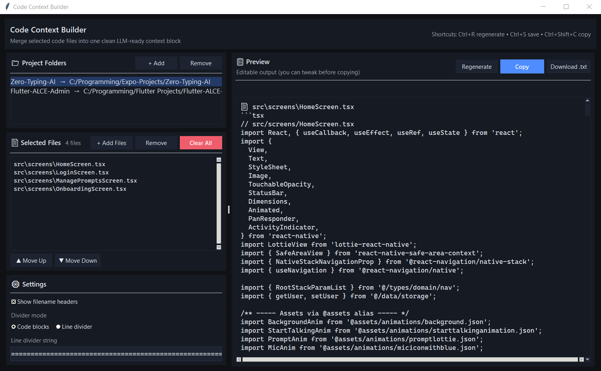

# Code Context Builder

A sleek desktop GUI tool that merges multiple code files into a single, clean text block — ready to paste into LLM chats like ChatGPT, Claude, or Gemini.



## Why?

When working with LLMs on coding tasks, you often need to share multiple files as context. Manually copying and pasting each file is tedious and error-prone. Code Context Builder lets you select files, arrange them, and generate a single formatted output in seconds.

## Features

- **Project Folders** — Save and switch between frequently used project directories
- **Folder Tree File Picker** — Browse your entire project tree with all subfolders visible at once — no more navigating in and out of directories to select files scattered across folders
- **Highlight-Based Selection** — Click files to select them (highlighted in a distinct color), click again to deselect. Double-click a folder to select all files inside it
- **Selection Order Preserved** — Files appear in the merged output in the exact order you clicked them
- **Smart Filtering** — Type in the filter bar to instantly narrow the tree by filename (e.g. `.tsx`, `controller`)
- **Smart Formatting** — Auto-detects 60+ languages and wraps content in appropriate markdown code blocks
- **Two Divider Modes** — Fenced code blocks (``` syntax) or custom line dividers
- **Live Preview** — Editable output panel lets you tweak before copying
- **One-Click Copy** — Send merged content straight to your clipboard
- **Export to .txt** — Save the output as a text file
- **Persistent Config** — Remembers your project folders, settings, and window size between sessions
- **Dark UI** — Modern dark theme designed for comfortable use

## Supported Languages

Python, JavaScript, TypeScript, JSX/TSX, HTML, CSS, SCSS, JSON, YAML, TOML, Java, Kotlin, Swift, C/C++, C#, Go, Rust, Ruby, PHP, Bash, SQL, Dart, Elixir, Haskell, Vue, Svelte, GraphQL, Protobuf, HCL, Dockerfile, and many more.

## Installation

### Prerequisites

- Python 3.8+
- Tkinter (included with most Python installations)

### Setup

```bash
git clone https://github.com/YOUR_USERNAME/code-context-builder.git
cd code-context-builder
python main.py
```

No external dependencies required — runs on the Python standard library.

## Usage

1. **Add a Project Folder** — Click `+ Add` under Project Folders and select your project root
2. **Select Files** — Click `+ Add Files` to open the folder tree picker, then click files to select them (they highlight green). Use the filter bar to narrow results. Double-click a folder to select all files within it.
3. **Arrange Order** — Use the ▲/▼ buttons to reorder files as needed
4. **Configure Output** — Toggle filename headers, choose divider mode, customize the divider string
5. **Copy or Save** — Hit `Copy` to clipboard or `Download .txt` to save

### Keyboard Shortcuts

| Shortcut       | Action             |
| -------------- | ------------------ |
| `Ctrl+R`       | Regenerate preview |
| `Ctrl+S`       | Save as .txt       |
| `Ctrl+Shift+C` | Copy to clipboard  |

### Folder Tree Picker

The file picker shows your full project structure as a tree — all files across all subfolders are visible at once.

- **Single click on a file** — toggles selection (green highlight)
- **Single click on a folder** — expands or collapses it
- **Double-click on a folder** — selects all files inside it (and expands if collapsed)
- **Filter bar** — type to filter files by name across the entire tree
- **Select All Visible / Deselect All** — bulk actions for quick selection
- **Browse button** — change the root folder without closing the picker

Common directories like `node_modules`, `.git`, `__pycache__`, `venv`, `dist`, and `build` are automatically hidden to keep the tree clean.

## Configuration

Settings are saved automatically to `config.json` in the app directory. This includes:

- Saved project folders
- Divider mode and custom divider string
- Filename header toggle
- Last used directory
- Window size and position

## License

MIT